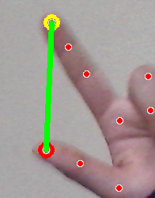
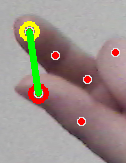

# Hand Volume Control ✋🔊

## Overview:
 This project allows you to control the volume of your system using hand gestures. It tracks the movement of your hand, specifically the distance between the thumb and index finger, and adjusts the system's volume based on that distance

## Features ✨:
* Volume Control via Hand Gestures: The program uses your hand's finger distance to control the volume.

    - Volume Up: When the distance between your thumb and index finger is large enough, the volume is increased.
        
     

    - Volume Down: When the distance between your thumb and index finger is smaller, the volume is decreased.
      
    

### Requirements:
* To run the script, you'll need to install the following Python libraries:
 * OpenCV for video processing
 * Mediapipe for hand tracking
 * PyAutoGUI for controlling the system volume

## How It Works ⚙️:
 * The script captures your webcam feed and detects hand landmarks using Mediapipe. By measuring the distance between the thumb and index finger, it adjusts the volume. It only responds to significant hand movements, not small fluctuations.

## Controls:
* Increase Volume: Move your thumb and index finger apart.
* Decrease Volume: Move your thumb and index finger closer together.
* Exit Program: Press the Esc key to stop the program.

Enjoy Coding!🚀
